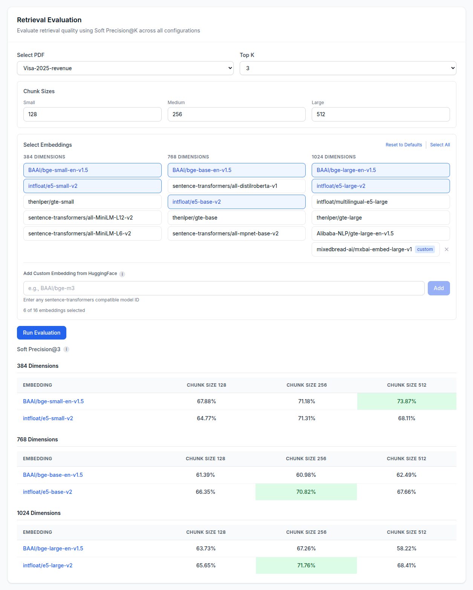

# RAG Bench

A local benchmarking tool for evaluating and optimizing RAG (Retrieval-Augmented Generation) pipeline configurations. Compare different embedding models, chunk sizes, and LLMs to find the optimal setup for your use case.

**`RAG Bench` is a work in progress.**

## How to Run

### Prerequisites
- Docker and Docker Compose
- NVIDIA GPU with CUDA support (24GB VRAM recommended)
- Pinecone API key
- HuggingFace token (for gated models)

### Setup

1. Create environment file:
```bash
cp .env.example .env
```

2. Edit `.env` with your API keys:
```
PINECONE_API_KEY=your_pinecone_api_key
HF_TOKEN=your_huggingface_token
```

3. Build and run:
```bash
sudo docker compose up --build
```

4. Access the UI at `http://localhost:3000`

## Test Dataset Creation

When PDF is uploaded:

1. The file is parsed and chunked into segments (chunk size: 1000, overlap: 200)
2. [Qwen2.5-32B-Instruct-AWQ](https://huggingface.co/Qwen/Qwen2.5-32B-Instruct-AWQ) generates questions that can only be answered by each chunk
3. The dataset is stored for evaluation

Example dataset structure:
```json
[
  {
    "question": "What is the maximum fine for non-compliance?",
    "source_chunk_id": "policy_doc.pdf_chunk_12",
    "source_text": "Non-compliance may result in fines up to $50,000..."
  }
]
```

## Retrieval Evaluation

Retrieval evaluation measures how relevant the retrieved documents are to the query using **Soft Precision@K**.

### How it works:

1. For each question in the dataset, retrieve the top-K chunks from the vector database
2. For each retrieved chunk, use [cross-encoder/ms-marco-MiniLM-L-6-v2](https://huggingface.co/cross-encoder/ms-marco-MiniLM-L-6-v2) to determine relevance to the question
3. The cross-encoder returns a logit, which is passed through a sigmoid to get a probability
4. The final score is the average probability across all retrieved chunks

### Why "Soft" Precision@K?

Traditional Precision@K uses binary classification (relevant/irrelevant). Soft Precision@K uses continuous probabilities, removing the need for arbitrary relevance thresholds.

### Configurable parameters:
- **Embedding models**: Compare different embedding models across dimensions
- **Chunk sizes**: Test small, medium, and large chunk configurations
- **Top-K**: Number of documents to retrieve



## Generation Evaluation

Generation evaluation measures how faithful the LLM's response is to the retrieved context. This metric quantifies how much the model is hallucinating versus grounding its answers in the provided context.

### How it works:

1. **Claim extraction**: Parse the generated answer into atomic factual claims using [Qwen2.5-32B-Instruct-AWQ](https://huggingface.co/Qwen/Qwen2.5-32B-Instruct-AWQ)
2. **Entailment verification**: For each claim, use [DeBERTa-v3-large-mnli-fever-anli-ling-wanli](https://huggingface.co/MoritzLaurer/DeBERTa-v3-large-mnli-fever-anli-ling-wanli) (which has an NLI use-case) to determine if the claim is supported by the retrieved context
3. **Faithfulness score**: Average the entailment probabilities across all claims

### Metrics:

| Metric | Description |
|--------|-------------|
| **Faithfulness** | How well the response is grounded in the retrieved context (vs. hallucination) |
| **TTFT** | Time to First Token - latency before generation starts |
| **T/s** | Tokens per second - generation throughput |

### Configurable parameters:
- **LLM models**: Compare different models across size categories (<5B, 5-10B, >10B)
- **Embedding model**: Which embedding to use for retrieval
- **Chunk size**: Size of retrieved chunks
- **Top-K**: Number of documents to retrieve
- **Question percentage**: Portion of the test dataset to evaluate


## Future Features

- **Re-rankers evaluation**: Allows re-ranking of documents retrieved from the vectore store
- **Recall@K**: Measure how many relevant chunks were retrieved out of all relevant chunks (using the source_chunk_id from the dataset)
- **Custom evaluation models**: Allow users to specify their own models for claim extraction and NLI verification
- **Custom dataset generation models**: Allow users to specify their own LLM for generating evaluation questions

## License

MIT
